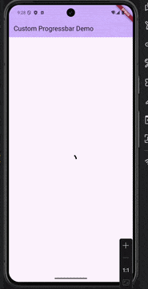
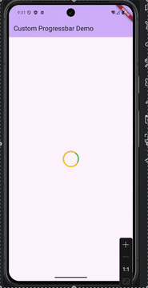
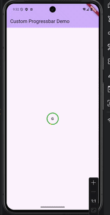
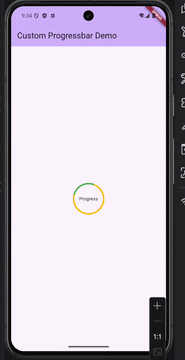
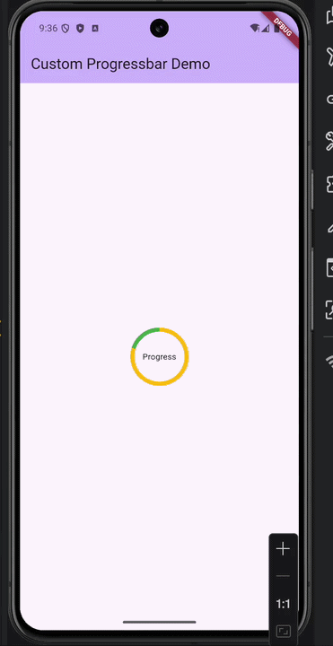
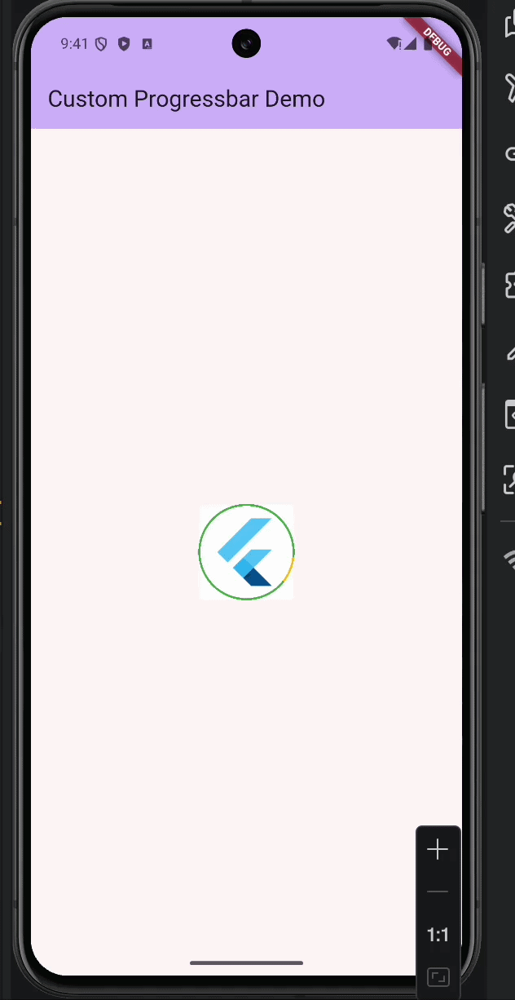

# Custom ProgressBar

🚀 A highly customizable circular progress bar for Flutter with support for center widgets, theming, and flexible sizing.

---

## ✨ Features

* ✅ Simple and clean API
* 🎯 Custom center widget (Icon, Text, Image, etc.)
* 🎨 Custom colors & stroke width
* 📱 Lightweight & easy to use
* 🔄 Backward compatible

---

## 📦 Installation

Add this to your `pubspec.yaml`:

```yaml
dependencies:
  custom_progressbar: 2.0.0
```

---

## 📸 Preview

### Default ProgressBar



### Custom Colors



### With Icon Center



### With Text Center



### With Progress Value



### With Image Center



---

## 🚀 Usage

### 1. Basic

``` dart
Center(
  child: ProgressBar(),
)
```

---

### 2. Custom Colors

``` dart
ProgressBar(
  size: 50,
  progressColor: Colors.amber,
  progressBackgroundColor: Colors.green,
)
```

---

### 3. With Icon

``` dart
ProgressBar(
  size: 50,
  progressColor: Colors.amber,
  progressBackgroundColor: Colors.green,
  center: Icon(Icons.g_mobiledata_rounded),
)
```

---

### 4. With Text

``` dart
ProgressBar(
  size: 80,
  progressColor: Colors.amber,
  progressBackgroundColor: Colors.green,
  center: Text(
    'Progress',
    style: TextStyle(fontSize: 12),
  ),
)
```

---

### 5. With Progress Value

``` dart
ProgressBar(
  size: 80,
  progressColor: Colors.amber,
  progressBackgroundColor: Colors.green,
  progressStrokeWidth: 6,
  progress: 0.8,
  center: Text(
    'Progress',
    style: TextStyle(fontSize: 12),
  ),
)
```

---

### 6. With Image

``` dart
ProgressBar(
  size: 90,
  progressColor: Colors.amber,
  progressBackgroundColor: Colors.green,
  progressStrokeWidth: 2,
  center: Image.asset('assets/img.png'),
)
```

---

## ⚙️ Parameters (New API)

| Parameter                 | Description                                          |
| ------------------------- | ---------------------------------------------------- |
| `size`                    | Size of the progress bar (width & height)            |
| `progress`                | Value from `0.0` to `1.0`                            |
| `center`                  | Widget displayed in center (Text, Icon, Image, etc.) |
| `progressColor`           | Color of progress indicator                          |
| `progressBackgroundColor` | Background track color                               |
| `progressStrokeWidth`     | Thickness of progress                                |

---

## 🔄 Migration Guide

### Old API (Deprecated)

``` dart
ProgressBar(
containerHeight: 40,
containerWidth: 40,
progressColor: Colors.red,
boxFit: BoxFit.contain,
iconHeight: 30,
iconWidth: 30,
imageFile: 'assets/icon.png',
progressStrokeWidth: 3.0,
progressHeight: 50,
progressWidth: 50,
),
```

---

### New API (Recommended)

``` dart
ProgressBar(
  size: 40,
  progress: 0.7,
  progressStrokeWidth: 3.0,
  center: Image.asset('assets/icon.png'),
)
```

---

## ⚠️ Deprecated API (Legacy Support)

The old API is still supported for backward compatibility, but **not recommended for new projects**.

### Mapping to New API

| Old API                             | New API                 |
| ----------------------------------- | ----------------------- |
| `containerHeight`, `containerWidth` | `size`                  |
| `imageFile`                         | `center: Image.asset()` |
| `iconHeight`, `iconWidth`           | handled inside `center` |
| `boxFit`                            | handled inside `center` |
| `progressHeight`, `progressWidth`   | auto-managed            |

---

## 📌 Notes

* `progress` value should be between `0.0` and `1.0`
* Values outside this range will be clamped internally
* Use `center` for flexible content instead of `imageFile`

---

## 💡 Upcoming Features

* 🎨 Gradient support
* ⚡ CustomPainter-based rendering
* 🎬 Smooth animations
* 📊 Multi-segment progress
* 🔄 Clockwise / Anti-clockwise progress

---

## ❤️ Support

If you like this package, consider giving it a ⭐ on GitHub!
